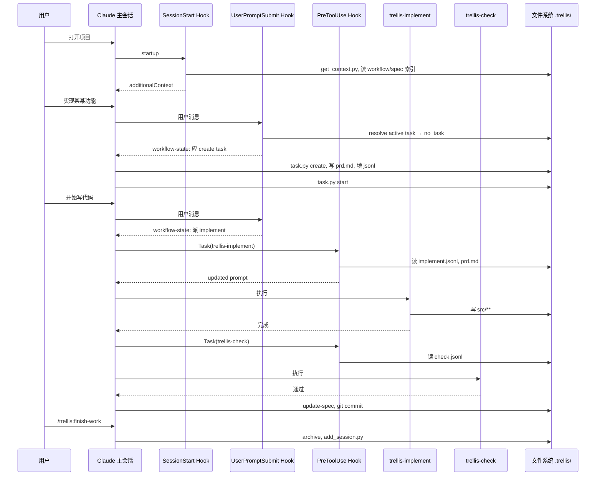

# Trellis × Claude Code 集成详解

本文说明 Trellis 仓库如何让 [Claude Code](https://claude.ai/code) 按结构化开发流程工作：文件里存知识，Hook 里注入上下文，子 Agent 分工写代码与质检，主会话负责编排。

**读者**：要在本仓库上二次开发 Trellis、或想理解「为什么 Claude Code 会自动知道当前任务 / spec」的开发者。

**相关源码**：

| 路径 | 角色 |
|------|------|
| `.trellis/` | 工作流、规范、任务、Python 脚本（平台无关核心） |
| `.claude/` | Claude Code 专属：settings、hooks、agents、skills、commands |
| `packages/cli/src/configurators/claude.ts` | `trellis init --claude` 生成 `.claude/` |
| `packages/cli/src/templates/shared-hooks/` | 多平台共享的 hook 脚本源码 |
| `AGENTS.md` | 写入各 AI 工具的通用子 Agent 纪律 |

---

## 1. 设计哲学

### 1.1 核心原则（来自 `.trellis/workflow.md`）

1. **先计划再写代码** — 任务目录 + `prd.md` 先于实现
2. **规范注入，不靠记忆** — spec 通过 Hook / JSONL 推送给子 Agent，而非指望主会话背下来
3. **一切持久化** — 对话会被 compact，文件不会
4. **增量开发** — 一次一个任务目录
5. **沉淀经验** — 任务结束后用 `trellis-update-spec` 写回 `.trellis/spec/`

### 1.2 Claude Code 在 Trellis 平台谱系中的位置

Trellis 把 AI 平台分为两类：

| 类型 | 代表平台 | 子 Agent 上下文 |
|------|----------|-----------------|
| **Class-1（push）** | Claude Code、Cursor、OpenCode、Kiro、CodeBuddy、Droid | `PreToolUse` hook 改写 `Task`/`Agent` 的 `prompt`，注入 prd + JSONL 中的 spec |
| **Class-2（pull）** | Codex、Copilot、Gemini、Qoder | Hook 无法改写子 Agent prompt；在 agent 定义里加「自己读 jsonl」的 prelude |

Claude Code 是 **Class-1 的参考实现**：SessionStart、UserPromptSubmit、PreToolUse 三类事件齐全。

### 1.3 职责分离

```text
┌─────────────────────────────────────────────────────────────────┐
│  主会话（Claude Code 默认 Agent）                                  │
│  · 与用户对话、建任务、写 prd、编排阶段                              │
│  · 默认不直接改业务代码 → 派发 trellis-implement / trellis-check   │
│  · 驱动 commit、提醒 /trellis:finish-work                         │
└───────────────┬─────────────────────────────────────────────────┘
                │ Task(subagent_type=...)
                ▼
┌─────────────────────────────────────────────────────────────────┐
│  子 Agent（.claude/agents/trellis-*.md）                          │
│  · implement：写代码，禁止 git commit                             │
│  · check：审查并自行修复                                            │
│  · research：调研，必须写入 tasks/.../research/                   │
└─────────────────────────────────────────────────────────────────┘
```

主会话的「行为合约」来自两处叠加：

- **SessionStart**：大块一次性上下文（workflow 摘要、git、任务、spec 索引）
- **每轮 UserPromptSubmit**：`<workflow-state>` 面包屑（当前阶段该做什么）

---

## 2. 目录与文件映射

### 2.1 `trellis init --claude` 生成什么

`packages/cli/src/configurators/claude.ts` 的 `configureClaude()`：

| 来源 | 写入目标 | 内容 |
|------|----------|------|
| `templates/claude/` | `.claude/agents/`, `settings.json` | 三个子 Agent 定义、Hook 注册 |
| `templates/shared-hooks/`（平台表 `claude`） | `.claude/hooks/` | `session-start.py`, `inject-workflow-state.py`, `inject-subagent-context.py` |
| `templates/common/commands/`（过滤掉 `start`） | `.claude/commands/trellis/` | `continue.md`, `finish-work.md` → `/trellis:continue`, `/trellis:finish-work` |
| `templates/common/skills/` + bundled | `.claude/skills/` | `trellis-brainstorm`, `trellis-check`, 等 |

**注意**：agent-capable 平台**不**安装 `/trellis:start` 命令——SessionStart hook 已承担「会话启动时加载 workflow」的职责（见 `filterCommands()`）。

### 2.2 `.claude/settings.json` 结构

```json
{
  "env": {
    "CLAUDE_BASH_MAINTAIN_PROJECT_WORKING_DIR": "1"
  },
  "hooks": {
    "SessionStart": [ { "matcher": "startup|clear|compact", ... } ],
    "PreToolUse": [ { "matcher": "Task|Agent", ... } ],
    "UserPromptSubmit": [ ... ]
  }
}
```

- `CLAUDE_BASH_MAINTAIN_PROJECT_WORKING_DIR`：Bash 工具保持在项目根目录，避免 hook / `task.py` 路径错乱。
- `Task` 与 `Agent` 两个 matcher 都指向同一 `inject-subagent-context.py`（兼容 Claude Code 工具重命名）。

模板里命令为 `{{PYTHON_CMD}}`，init 时替换为 `python3`（Windows 上可能是 `py` 等，见 `replacePythonCommandLiterals`）。

### 2.3 `.trellis/` 核心布局

```text
.trellis/
├── workflow.md              # 阶段定义 + [workflow-state:*] 面包屑正文（单一真相源）
├── spec/                    # 按 package/layer 组织的编码规范
├── tasks/
│   └── MM-DD-slug/
│       ├── task.json        # status: planning | in_progress | completed
│       ├── prd.md
│       ├── implement.jsonl  # 实现子 Agent 要读的 spec 列表
│       ├── check.jsonl      # 检查子 Agent 要读的 spec 列表
│       ├── research/
│       └── info.md          # 可选技术设计
├── scripts/
│   ├── task.py              # 任务 CRUD、归档、PR
│   ├── get_context.py       # 会话上下文输出
│   └── common/
│       ├── active_task.py   # 会话级「当前任务」解析
│       └── task_context.py  # JSONL 管理
├── workspace/<developer>/   # 开发者日志
└── .runtime/sessions/       # 每会话 active task 指针（gitignore）
```

---

## 3. Hook 系统（自动化的核心）

三个 Python hook 与 Claude Code 生命周期绑定；源码在 `packages/cli/src/templates/shared-hooks/`，安装后位于 `.claude/hooks/`。

```text
用户打开项目 / 清空 / compact
        │
        ▼
   SessionStart ──► session-start.py ──► additionalContext（大块）
        │
用户每条消息
        │
        ▼
 UserPromptSubmit ──► inject-workflow-state.py ──► <workflow-state>（面包屑）
        │
主会话调用 Task(trellis-implement)
        │
        ▼
   PreToolUse ──► inject-subagent-context.py ──► updatedInput.prompt（子 Agent 上下文）
```

可通过环境变量禁用：`TRELLIS_HOOKS=0` 或 `TRELLIS_DISABLE_HOOKS=1`。

---

### 3.1 SessionStart → `session-start.py`

**触发**：`matcher` 为 `startup`、`clear`、`compact`（会话启动、清空历史、上下文压缩后）。

**输入**：Claude Code 经 stdin 传入 JSON（含 `cwd`、可选 `session_id` 等）。

**输出格式**（Claude Code 专用字段）：

```json
{
  "hookSpecificOutput": {
    "hookEventName": "SessionStart",
    "additionalContext": "<session-context>...大量 XML 风格块...</ready>"
  }
}
```

**注入内容块**（按顺序）：

| 块 | 内容 |
|----|------|
| `<session-context>` | 说明这是 Trellis 项目 |
| `<first-reply-notice>` | 首条回复用一句中文确认 SessionStart 已加载（一次性） |
| `<migration-warning>` | 若检测到旧版 spec 布局则警告 |
| `<current-state>` | 运行 `get_context.py` 的文本输出（git、开发者、当前任务、活跃任务列表等） |
| `<workflow>` | `workflow.md` 摘要（**剥离** `[workflow-state:*]` 块，避免与每轮面包屑重复） |
| `<guidelines>` | spec 索引路径；`guides/index.md` 全文内联；说明主会话应派子 Agent |
| `<task-status>` | 根据 active task + `task.json.status` 生成的结构化下一步提示 |
| `<ready>` | 禁止重复读取已注入内容；若任务 READY 则直接执行下一步 |

**Session 身份桥接（重要）**：

Hook 解析出 `context_key` 后，若存在 `CLAUDE_ENV_FILE`，会追加：

```bash
export TRELLIS_CONTEXT_ID='<context_key>'
```

这样主会话稍后通过 **Bash** 执行 `task.py start` 时，子进程也能解析到同一会话的 active task——否则只有 Hook 内有 session 身份，shell 里没有。

---

### 3.2 UserPromptSubmit → `inject-workflow-state.py`

**触发**：用户每次提交 prompt（无 matcher，全量触发）。

**职责**：根据当前任务状态，从 `workflow.md` 解析对应 `[workflow-state:STATUS]` 块，注入 `<workflow-state>`。

**状态解析逻辑**：

```text
resolve_active_task()
    │
    ├─ 无 .trellis/ → 静默 exit 0（非 Trellis 项目）
    ├─ 无 active task → 伪状态 no_task
    ├─ 任务目录已删 → stale_<source_type>
    └─ 否则读 task.json.status → planning | in_progress | completed | 自定义
```

**面包屑块与阶段对应**（正常流程）：

| `task.json.status` | workflow 块 | 主会话典型行为 |
|--------------------|-------------|----------------|
| （无任务） | `no_task` | A 纯问答 / B 建任务 / C 用户说跳过 trellis |
| `planning` | `planning` | `trellis-brainstorm`、填 jsonl、`task.py start` |
| `in_progress` | `in_progress` | 派 implement → check → update-spec → commit → finish-work |

`[workflow-state:completed]` 在常规流程中**几乎不会触发**：`task.py archive` 在同一调用里把目录移到 `archive/` 并清除 session 指针。

**契约要点**（详见 `.trellis/spec/cli/backend/workflow-state-contract.md`）：

- `workflow.md` 是面包屑正文的**唯一真相源**；hook 内无硬编码 fallback 文案
- 每个 `[required · once]` 工作流步骤必须在对应 `[workflow-state:*]` 块里有一句 enforcement，否则主会话会**静默跳过**（曾导致 Phase 1.3 jsonl 与 Phase 3.4 commit 被跳过）
- 子 Agent 也可能看到面包屑，块内文案须对子 Agent 安全（含 recursion guard 说明）

**输出**：

```json
{
  "hookSpecificOutput": {
    "hookEventName": "UserPromptSubmit",
    "additionalContext": "<workflow-state>\n...\n</workflow-state>"
  }
}
```

---

### 3.3 PreToolUse → `inject-subagent-context.py`

**触发**：`Task` 或 `Agent` 工具调用**之前**（matcher 精确匹配工具名）。

**支持的子 Agent**：

| `subagent_type` | 需要 active task | JSONL | 额外文件 |
|-----------------|------------------|-------|----------|
| `trellis-implement` | 是 | `implement.jsonl` | `prd.md`, `info.md` |
| `trellis-check` | 是 | `check.jsonl` | `prd.md`；prompt 含 `[finish]` 时用轻量 finish 上下文 |
| `trellis-research` | 否（可无任务） | 无 | 注入 spec 树概览，输出须写 `research/` |

**处理流程**：

```text
1. 解析 stdin → subagent_type, original_prompt
2. find_repo_root(cwd)
3. get_current_task() → .trellis/tasks/MM-DD-name
4. read_jsonl_entries(implement.jsonl | check.jsonl)
      · 跳过无 "file" 字段的行（如种子行 {"_example": "..."}）
      · 支持 {"file": "dir/", "type": "directory"}
5. 拼接 get_*_context() + build_*_prompt()
6. 输出 updatedInput.prompt（多平台字段兼容）
```

**implement 上下文拼接顺序**：

1. `implement.jsonl` 中每个文件的全文（`=== path ===` 分隔）
2. `prd.md`
3. `info.md`（若存在）

**输出示例**（Claude Code 读取 `hookSpecificOutput.updatedInput`）：

```json
{
  "hookSpecificOutput": {
    "hookEventName": "PreToolUse",
    "permissionDecision": "allow",
    "updatedInput": {
      "subagent_type": "trellis-implement",
      "prompt": "# Implement Agent Task\n\n## Your Context\n\n..."
    }
  }
}
```

**静默不注入**（exit 0 无输出）的情况：

- `subagent_type` 不在支持列表
- implement/check 无 active task 或任务目录不存在
- 拼出的 context 为空

---

## 4. 会话级 Active Task 机制

### 4.1 为什么需要 session-scoped 指针

多个 Claude Code 窗口可能同时打开同一仓库、做不同任务。Trellis **不用**全局「当前任务」文件，而在：

```text
.trellis/.runtime/sessions/<context_key>.json
```

内存储该会话指向的任务路径。

### 4.2 Context Key 如何生成

实现：` .trellis/scripts/common/active_task.py`

优先级（简化）：

1. Hook stdin 中的 `session_id` / `conversation_id` / `transcript_path`
2. 环境变量：`TRELLIS_CONTEXT_ID`（SessionStart 写入 `CLAUDE_ENV_FILE`）
3. Claude 专用：`CLAUDE_SESSION_ID`, `CLAUDE_CODE_SESSION_ID`, `CLAUDE_TRANSCRIPT_PATH`

Key 形如：`claude_<sanitized_session_id>` 或 `claude_transcript_<hash>`。

### 4.3 任务命令与状态流转

```bash
# 创建（status=planning；有 session 时自动设为该会话的 active task）
python3 ./.trellis/scripts/task.py create "功能标题" --slug my-feature

# 规划完成后激活（status → in_progress；面包屑切到 in_progress）
python3 ./.trellis/scripts/task.py start .trellis/tasks/06-12-my-feature

# 结束会话指针（不改 status）
python3 ./.trellis/scripts/task.py finish

# 归档（status=completed，移入 archive/，清除相关 session 文件）
python3 ./.trellis/scripts/task.py archive 06-12-my-feature

# 调试：当前任务与解析来源
python3 ./.trellis/scripts/task.py current --source
```

**常见陷阱**：

- 在 `create` 后立刻 `start` → 跳过 brainstorm 与 jsonl curation（workflow 明确禁止）
- 终端里 `task.py current` 为空 → 未 export `TRELLIS_CONTEXT_ID` 或不在 Claude Code Bash 环境内
- `start` 报错 session identity → 需在 Claude Code 会话内执行，或手动 `export TRELLIS_CONTEXT_ID=...`

---

## 5. 子 Agent 定义（`.claude/agents/`）

Claude Code 通过 `Task(subagent_type="trellis-implement", prompt="...")` 加载同名 markdown。

### 5.1 通用 frontmatter

```yaml
---
name: trellis-implement
description: |
  ...
tools: Read, Write, Edit, Bash, Glob, Grep, ...
---
```

### 5.2 三个 Trellis 子 Agent

| 文件 | 职责 | 禁止 |
|------|------|------|
| `trellis-implement.md` | 按 spec + prd 实现；自跑 lint/typecheck | `git commit/push/merge`；再派 implement/check |
| `trellis-check.md` | `git diff` 对照 spec；**自行修复**；跑验证 | 同上 |
| `trellis-research.md` | 内外部检索；**必须**写入 `{TASK}/research/*.md` | 修改 research 以外代码 |

每个定义含 **Recursion Guard**：子 Agent 看到 workflow 里「派 trellis-implement」的指令时，应视为已在子 Agent 角色中，不得再派发。

### 5.3 主会话派发协议

`workflow.md` `[workflow-state:in_progress]` 要求派发 prompt **首行**：

```text
Active task: .trellis/tasks/06-12-my-feature
```

在 Claude Code 上这行通常冗余（hook 会注入任务路径），但在以下场景是**关键 fallback**：

- Windows + PreToolUse 静默跳过（已知上游问题）
- `--continue` 恢复会话
- Hook 被禁用或 fork 分发

---

## 6. Skills 与 Slash Commands

### 6.1 Skills（`.claude/skills/trellis-*/SKILL.md`）

由 `resolveSkills()` 从 `packages/cli/src/templates/common/skills/` 生成，带 `trellis-` 前缀与 SKILL frontmatter：

| Skill | 用途 | 典型阶段 |
|-------|------|----------|
| `trellis-brainstorm` | 交互式需求探索，更新 `prd.md` | Phase 1.1 |
| `trellis-before-dev` | 读 spec 清单（**主会话 inline 时**；默认派子 Agent 时不走此路） | Phase 2（override） |
| `trellis-check` | 质量验证清单 | Phase 2.2 / 3.1 |
| `trellis-update-spec` | 任务经验写回 spec | Phase 3.3 |
| `trellis-break-loop` | 反复修同一 bug 时的根因分析 | Phase 3.2 |

另有 bundled skills：`trellis-meta`, `python-design`, `first-principles-thinking`, `contribute` 等。

### 6.2 Commands（`.claude/commands/trellis/`）

| 命令 | 作用 |
|------|------|
| `/trellis:continue` | 加载上下文 + 判断停在 workflow 哪一步 |
| `/trellis:finish-work` | 归档任务 + 写 journal（**不**在此 commit 代码） |

`finish-work` 会拒绝在「本任务相关代码未 commit」时完成；代码 commit 在 workflow Phase 3.4 由主会话驱动。

### 6.3 `AGENTS.md`

仓库根目录的 `AGENTS.md`（TRELLIS 管理块）写入 Claude Code 等工具：

- 子 Agent 必须等到终端状态再继续
- 不得取消未完成的子 Agent
- Codex 专用 `fork_turns="none"` 等（Claude Code 用 `Task` 工具 await 即可）

---

## 7. JSONL 上下文（Phase 1.3）

### 7.1 格式

`implement.jsonl` / `check.jsonl` 每行一个 JSON：

```jsonl
{"file": ".trellis/spec/cli/backend/index.md", "reason": "本任务改 CLI 后端"}
{"file": ".trellis/tasks/06-12-foo/research/auth-lib.md", "reason": "调研结论"}
{"_example": "删除此行并填入真实条目"}
```

- **应放入**：spec 指南、research 产物
- **不应放入**：即将修改的 `src/**` 代码（实现时由子 Agent 自己读）

### 7.2 管理命令

```bash
python3 ./.trellis/scripts/task.py add-context <task-dir> implement <path> "<reason>"
python3 ./.trellis/scripts/task.py list-context <task-dir> implement
python3 ./.trellis/scripts/task.py validate <task-dir>
```

发现相关 spec：

```bash
python3 ./.trellis/scripts/get_context.py --mode packages
```

### 7.3 完成标准

进入 `in_progress` 前，`implement.jsonl` 须有**人工/Agent 策划的真实条目**；仅种子 `_example` 行不算完成。

---

## 8. 三阶段工作流（Claude Code 端到端）

### 8.1 阶段总览

```text
Phase 1 Plan     → task create → brainstorm → jsonl → task start
Phase 2 Execute  → trellis-implement → trellis-check（可循环）
Phase 3 Finish   → trellis-check 终验 → update-spec → git commit → /trellis:finish-work
```

### 8.2 时序图



### 8.3 主会话默认 vs 逃逸 hatch

| 场景 | 默认 | 用户需明确说 |
|------|------|--------------|
| 无任务时要改代码 | `task.py create` 走流程 | 「跳过 trellis」「直接改」「别建任务」等 |
| in_progress 时写代码 | 派 `trellis-implement` | 「你直接改」「no sub-agent」等 |

短语列表以 `workflow.md` `[workflow-state:no_task]` / `[workflow-state:in_progress]` 为准。

---

## 9. `get_context.py` 模式

```bash
python3 ./.trellis/scripts/get_context.py                    # 默认：完整会话上下文
python3 ./.trellis/scripts/get_context.py --json
python3 ./.trellis/scripts/get_context.py --mode record      # finish-work 用
python3 ./.trellis/scripts/get_context.py --mode packages  # 列出 spec 包/层
python3 ./.trellis/scripts/get_context.py --mode phase       # Phase Index
python3 ./.trellis/scripts/get_context.py --mode phase --step 2.1 --platform claude
```

SessionStart 内嵌的是默认模式输出。

---

## 10. 与文档/历史能力的差异

### 10.1 Ralph Loop（SubagentStop）

`trellis-meta` 文档中提到的 `ralph-loop.py`（Check Agent 停止时跑 lint/typecheck）**未**包含在当前默认 `SHARED_HOOKS_BY_PLATFORM.claude` 列表中；仓库内也无 `ralph-loop.py` 文件。质检主要由 `trellis-check` 子 Agent 自行执行验证命令完成。

### 10.2 Dispatch / Plan / Debug Agent

早期设计有 `dispatch.md`、`plan.md` 等编排 Agent；当前 workflow 由**主会话 + workflow 面包屑**直接编排，不再默认派发 `dispatch` Agent。

---

## 11. 故障排查

| 现象 | 可能原因 | 处理 |
|------|----------|------|
| 首屏无 Trellis 上下文 | `.claude/settings.json` hooks 缺失或未 `trellis init` | 重跑 init/update；检查 settings |
| 每轮不提醒 workflow | `UserPromptSubmit` hook 失败/超时 | 手动跑 `inject-workflow-state.py`；看 stderr |
| `task.py current` 为空 | Shell 无 session key | 在 Claude Code 内执行；或 `echo $TRELLIS_CONTEXT_ID` |
| 子 Agent 未读 spec | jsonl 仅 `_example`；或 PreToolUse 未触发 | 完成 Phase 1.3；派发 prompt 加 `Active task:` 行 |
| implement 只有 prd | `implement.jsonl` 空 | hook stderr 有 WARN |
| AI 跳过 brainstorm/commit | `workflow-state` 块与工作流步骤不同步 | 编辑 `workflow.md` 对应块 |
| Windows JSON 错误 | Hook 输出编码 | 脚本已强制 UTF-8；见 migration  changelog |

**手动测试 Hook**：

```bash
# 需在项目根；SessionStart 从 stdin 读 JSON
echo '{"cwd":"'"$PWD"'"}' | python3 .claude/hooks/session-start.py

# PreToolUse 需构造 TOOL_INPUT
echo '{"tool_name":"Task","tool_input":{"subagent_type":"trellis-implement","prompt":"test"},"cwd":"'"$PWD"'"}' \
  | python3 .claude/hooks/inject-subagent-context.py
```

---

## 12. 自定义与扩展

| 需求 | 编辑位置 |
|------|----------|
| 改每轮 AI 行为提示 | `.trellis/workflow.md` 中 `[workflow-state:STATUS]` 块 |
| 改 SessionStart 注入内容 | `packages/cli/src/templates/shared-hooks/session-start.py` → `trellis update` |
| 改子 Agent 注入逻辑 | `inject-subagent-context.py` |
| 新增子 Agent 类型 | `.claude/agents/*.md` + hook 中 `AGENTS_ALL` 与 context 函数 |
| 任务生命周期副作用 | `task.json` 的 `hooks.after_*` |
| 仅本地覆盖 Claude 配置 | 直接改 `.claude/`（注意 `trellis update` 可能覆盖受管块） |

修改 `[required · once]` 步骤时，**必须**同步更新对应 `[workflow-state:*]` 块，否则回归测试 `test/regression.test.ts` 可能失败。

---

## 13. 源码索引（快速定位）

```text
packages/cli/src/configurators/claude.ts          # init 入口
packages/cli/src/templates/shared-hooks/index.ts  # 各平台安装哪些 hook
packages/cli/src/templates/claude/settings.json   # hooks 注册模板
packages/cli/src/templates/claude/agents/         # 子 Agent 模板

.claude/settings.json                             # 已安装的 Claude 配置
.claude/hooks/*.py                                # 已安装的 hook（来自 shared-hooks）
.claude/agents/trellis-*.md                       # 已安装的子 Agent
.claude/commands/trellis/*.md                     # Slash 命令
.claude/skills/trellis-*/SKILL.md                 # Skills

.trellis/workflow.md                              # 工作流 + 面包屑正文
.trellis/scripts/task.py                          # 任务 CLI
.trellis/scripts/common/active_task.py            # Session → task 解析
.trellis/spec/cli/backend/workflow-state-contract.md  # 面包屑运行时契约
```

---

## 14. 一句话总结

**Trellis 把流程与知识放在 `.trellis/` 文件里，用 `.claude/settings.json` 注册三个 Python Hook，在会话启动、每轮用户输入、子 Agent 派发三个时刻自动注入上下文；主会话按 `workflow.md` 面包屑编排，用 `Task` 调用 `trellis-implement` / `trellis-check` / `trellis-research` 分工执行——这就是本仓库让 Claude Code「按 Trellis 流程工作」的完整机制。**
